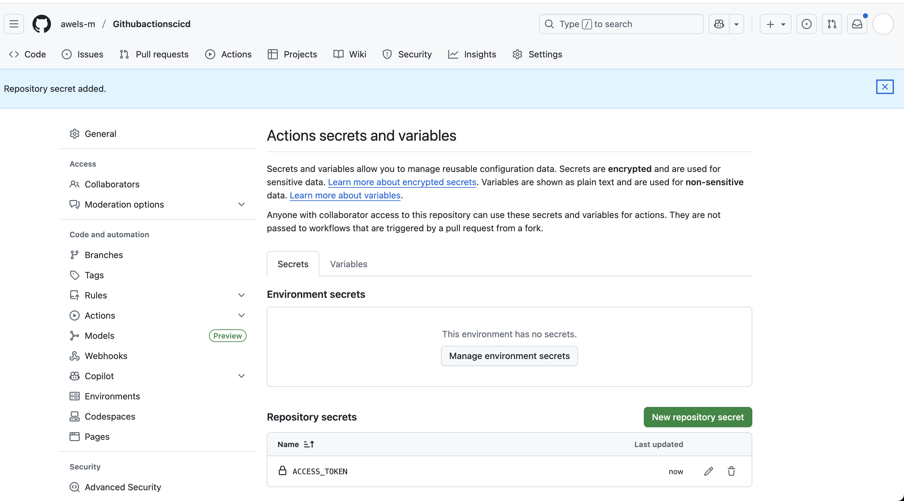

# GithubactionsCICD-Course-project
here i will be submitting my project on the above subject

# Project: Github Actions and CI/CD Course project -YAML

Author
Awele Muogbo

## Overview

This document is an exhaustive narrative of the work I carried out to implement continuous integration for a small Node.js project using GitHub Actions. It walks through every phase—from initializing the codebase and authoring Jest tests, to building a robust CI pipeline that demonstrates environment variables, outputs, and secret handling, and finally extending the pipeline into a parallel “build matrix” that runs across multiple operating systems and Node.js versions. I also chronicle the specific errors I genuinely encountered, the exact messages I saw, the root causes, and the precise fixes I applied. Everything is presented in plain text for easy reuse.

### Objectives

Stand up a minimal Node.js repository containing testable functions.

Add Jest-based unit tests and connect them to npm scripts so they run locally and in CI.

Create a GitHub Actions workflow that:

Checks out the repository,

Installs a specific Node.js version and restores npm caches,

Installs dependencies deterministically,

Executes a “build” only when appropriate,

Runs tests automatically,

Demonstrates environment variables, step outputs, and secure secrets.

Evolve the pipeline into a matrix that executes in parallel on:

ubuntu-latest, macos-latest, and windows-latest,

Node.js versions 20, 22, and 24.

Record the real failures encountered (YAML parse errors, misuse of secrets in conditions, accidental shell/Node confusion) and how I resolved each one to reach a stable configuration.

### 2. Local Environment and Repository Setup

I worked on a MacBook inside VS Code. The repository included a minimal Node.js codebase (a hello function and a pure addition function), Jest tests for both, a package.json that defined the necessary scripts and dependencies, and a workflow file at .github/workflows/main.yml.

### 2.1 Node project files (final snapshot)

index.js
Contains a function named hello that returns the string Hello World!, exported via module.exports so tests can import it.

sum.js
Exports a function sum(a, b) that simply returns a + b.

sum.test.js
Houses two Jest test cases:

Confirms sum(2, 3) equals 5,

Verifies hello() returns the literal “Hello World!”.

package.json
Key choices:

jest is listed in devDependencies at version ^30.1.3,

scripts include:

start: node index.js,

build: echo "Building (nothing to compile for plain JS)" (a placeholder to show how a build step would work in CI),

test: jest --ci --reporters=default for consistent output in CI environments.

### 3. First CI Workflow Draft

I created a workflow at .github/workflows/main.yml that defined a build job triggered on push and pull_request to the main branch. The job sequence was designed to:

Check out the repo using actions/checkout@v4,

Install Node.js using actions/setup-node@v4 pinned to Node 24 and enable npm caching,

Print a workflow-scoped environment variable (CUSTOM_VAR) as a sanity check,

Install dependencies with npm ci for lockfile-faithful installs,

Run npm run build only on push events to main (to showcase conditional logic),

Execute tests with npm test (Jest),

Demonstrate modern step outputs by writing a value to $GITHUB_OUTPUT in one step and reading it in a subsequent step,

Demonstrate safe secret consumption without ever printing the secret itself.

At this stage, the runner was ubuntu-latest; I confirmed this is independent of my Mac—using Ubuntu on Actions is common even when developing on macOS.

#### Real Problems I Encountered (and How I Fixed Them)
#### 4.1 Tried to use a shell heredoc while running Node (local mistake)

What I saw
When I inadvertently ran a heredoc command through Node (for example, cat > index.js << 'EOF' …) I got:

ReferenceError: cat is not defined
at Object.<anonymous> (/Users/.../index.js:1:1)

Why it happened
cat is a shell command; Node attempted to parse it as JavaScript.

#### What I did to fix it
I executed file-creation commands in the shell (Terminal/VS Code terminal not running node) or edited files directly in VS Code. I reserved node index.js purely for running JavaScript.

#### 4.2 Red underline and a workflow validation error around line 53

What I saw
VS Code flagged a red marker on a line similar to:
run: echo "Received: ${{ steps.compute.outputs.value }}"

GitHub then failed the workflow with:
Invalid workflow file. You have an error in your yaml syntax on line 53.

Why it happened
Embedding ${{ … }} within a quoted one-liner on run: can trigger subtle parser quirks in GitHub Actions.

What I did to fix it
I switched to a block scalar to make the shell content explicit and multi-line safe:

run: |
echo "Received: ${{ steps.compute.outputs.value }}"

That eliminated the parser complaint and is the recommended style for multi-line or expression-containing commands.

#### 4.3 Used secrets.* directly inside an if: condition (hard failure)

What I saw
I originally wrote:
if: ${{ secrets.ACCESS_TOKEN != '' }}

GitHub’s validator responded with:
Invalid workflow file … Unrecognized named-value: 'secrets'. Located at position 1 within expression: secrets.ACCESS_TOKEN != ''

Why it happened
GitHub Actions evaluates if: expressions before secrets are injected; secrets.* is not available there.

What I did to fix it
I exposed the secret as a job-level environment variable and used env.* in the condition:

Under jobs.build I added:
env:
ACCESS_TOKEN: ${{ secrets.ACCESS_TOKEN }}

Then the guarded step used:
if: ${{ env.ACCESS_TOKEN != '' }}

Inside the step I referenced the secret as $ACCESS_TOKEN but only displayed its length to avoid leakage.

#### 4.4 YAML indentation and tabs (potential parse pitfalls)

What I saw
YAML can break on invisible whitespace differences.

Why it happened
Mixing tabs and spaces or inconsistent spacing levels can confuse the YAML/Actions parser.

What I did to fix it
I standardized on two spaces per indent, removed tabs (using a regex search for \t), enabled “Render Whitespace,” and ensured consistent indentation throughout the file. This prevented formatting-related failures.

#### 1Creating and Using a GitHub Secret (ACCESS_TOKEN)

I added a repository secret to demonstrate secure usage:

Steps I followed:

Opened the repository on GitHub.

Navigated to Settings → Secrets and variables → Actions.

Clicked New repository secret.

Entered Name: ACCESS_TOKEN and supplied a value.

Saved.

In the workflow, I surfaced the secret at the job level:

env:
ACCESS_TOKEN: ${{ secrets.ACCESS_TOKEN }}

Then I used a condition that checks env.ACCESS_TOKEN (legal), not secrets.ACCESS_TOKEN (illegal in if:):

name: Use secret (safe demo)
if: ${{ env.ACCESS_TOKEN != '' }}
run: |
echo "Secret length is ${#ACCESS_TOKEN}"

Example call (commented to avoid misuse):
curl -H "Authorization: Bearer $ACCESS_TOKEN" https://api.example.com/me

This proves the secret is available without ever printing its value.

### 6.  Demonstrating Environment Variables and Step Outputs
6.1 Workflow-level environment variable (simple verification)

At the top of the YAML:
env:
CUSTOM_VAR: "hello-from-workflow"

I verified it in a step:

name: Show env var
run: echo "CUSTOM_VAR is $CUSTOM_VAR"

6.2 Producing and consuming step outputs (modern approach)

Producer step:

id: compute
name: Compute value
run: |
echo "value=hello-from-step-one" >> "$GITHUB_OUTPUT"

Consumer step:

name: Use previous step output
run: |
echo "Received: ${{ steps.compute.outputs.value }}"

The logs contained “Received: hello-from-step-one,” confirming output flow works as expected.

#### 7. Final Single-Job CI Flow (prior to matrices)

The build job running on ubuntu-latest ultimately did the following:

Checked out the repository.

Installed Node 24 with caching enabled.

Printed CUSTOM_VAR for confirmation.

Installed dependencies with npm ci.

Executed a build only on pushes to main.

Ran tests with npm test.

Wrote a value to $GITHUB_OUTPUT and read it in a subsequent step.

Demonstrated safe secret handling using a guarded step that ran only when ACCESS_TOKEN existed.

After addressing the parsing and secrets issues, this job ran cleanly.

#### 8. Lesson 2: Configuring Build Matrices (parallel multi-environment CI)

To satisfy the objective of matrix testing, I added a second job named test-matrix to run the same test flow across multiple OS and Node versions in parallel, with correct dependency management per environment.

Design choices:

Operating systems: ubuntu-latest, macos-latest, windows-latest,

Node versions: 20, 22, and 24,

defaults.run.shell: bash to keep commands uniform across OSes,

actions/setup-node@v4 with cache: npm to ensure fast and reliable installs keyed by OS + Node + lockfile,

npm ci followed by npm test in each leg.

This produced nine concurrent jobs (3 OS × 3 Node versions). Each job installed dependencies deterministically and ran the Jest tests. The run succeeded across the matrix, validating cross-platform behavior.

Optionally, I could add needs: build to make the matrix wait for the single build job; both patterns are valid depending on coordination needs.

#### 9. Why ubuntu-latest is acceptable while developing on macOS

GitHub Actions runners are independent of my development laptop. The OS specified in runs-on controls the cloud environment that executes my jobs. Using ubuntu-latest is typical due to speed and wide tool support. When platform-specific behavior matters, adding macOS and Windows in a matrix (which I did) is the cleanest solution.

#### 10. Final Files (plain text for easy reuse)

package.json (key parts)

name: githubactionscicd
version: 1.0.0
main: index.js
type: commonjs
scripts:
start: node index.js
build: echo "Building (nothing to compile for plain JS)"
test: jest --ci --reporters=default
devDependencies:
jest: ^30.1.3

index.js

function hello() {
return "Hello World!";
}
module.exports = { hello };

sum.js

function sum(a, b) {
return a + b;
}
module.exports = sum;

sum.test.js

const sum = require('./sum');
const { hello } = require('./index');

test('adds 2 + 3 = 5', () => {
expect(sum(2, 3)).toBe(5);
});

test('hello() returns "Hello World!"', () => {
expect(hello()).toBe('Hello World!');
});

.github/workflows/main.yml (final)

name: CI

on:
push:
branches: [ "main" ]
pull_request:
branches: [ "main" ]

env:
CUSTOM_VAR: "hello-from-workflow"

jobs:

build:
runs-on: ubuntu-latest
env:
ACCESS_TOKEN: ${{ secrets.ACCESS_TOKEN }}
steps:
- name: Check out code
uses: actions/checkout@v4

  - name: Set up Node.js  
    uses: actions/setup-node@v4  
    with:  
      node-version: '24'  
      cache: 'npm'

  - name: Show env var  
    run: echo "CUSTOM_VAR is $CUSTOM_VAR"

  - name: Install dependencies  
    run: npm ci

  - name: Build (only on push to main)  
    if: ${{ github.event_name == 'push' && github.ref == 'refs/heads/main' }}  
    run: npm run build

  - name: Run tests  
    run: npm test

  - id: compute  
    name: Compute value  
    run: |  
      echo "value=hello-from-step-one" >> "$GITHUB_OUTPUT"

  - name: Use previous step output  
    run: |  
      echo "Received: ${{ steps.compute.outputs.value }}"

  - name: Use secret (safe demo)  
    if: ${{ env.ACCESS_TOKEN != '' }}  
    run: |  
      echo "Secret length is ${#ACCESS_TOKEN}"  
      # Example (do not print the token):  
      # curl -H "Authorization: Bearer $ACCESS_TOKEN" https://api.example.com/me

test-matrix:
name: Test (Node ${{ matrix.node }} • ${{ matrix.os }})
runs-on: ${{ matrix.os }}
defaults:
run:
shell: bash
strategy:
fail-fast: false
matrix:
os: [ubuntu-latest, macos-latest, windows-latest]
node: [20, 22, 24]
steps:
- name: Check out code
uses: actions/checkout@v4

  - name: Set up Node ${{ matrix.node }}  
    uses: actions/setup-node@v4  
    with:  
      node-version: ${{ matrix.node }}  
      cache: npm

  - name: Install dependencies  
    run: npm ci

  - name: Run tests  
    run: npm test

### Results

Local runs of npm test consistently succeeded.

The single build job executed properly on ubuntu-latest:

Conditional build logic worked exactly as intended,

Step outputs were produced and consumed successfully,

The secret step ran only when ACCESS_TOKEN existed and printed only its length.

The matrix job launched nine parallel legs (three OSes × three Node versions). Every leg restored the proper environment, installed dependencies reproducibly with npm ci, and ran the Jest tests—providing high confidence in cross-platform compatibility.

###  Lessons Learned (Technical)

Don’t run shell constructs in Node—keep file creation and heredocs in a shell session.

Prefer run: | (block scalars) when mixing expressions and shell, to avoid YAML/parser edge cases.

Never place secrets.* inside if:. Instead, expose secrets on the job via env and condition against env.SECRET_NAME.

Standardize on spaces for YAML (two spaces per indent) and eliminate tabs; make whitespace visible in the editor to catch issues early.

Use npm ci for clean, lockfile-driven installs.

Leverage actions/setup-node@v4 with cache: npm to speed up CI and tie caches to OS + Node + lockfile.

Use matrix builds to validate multiple OS and Node combinations in parallel—this catches platform-specific issues before they reach users.

### Feedback Requests

I want to acknowledge the guidance from darey.io. Their materials enabled me to take this from zero to a fully functioning CI/CD workflow. The tutorials gave me the structure to:

Initialize a clean Node.js project with sensible npm scripts,

Add Jest as a devDependency and use CI-friendly flags,

Build a GitHub Actions workflow that properly separates workflow-level and job-level environment variables,

Handle secrets safely and avoid evaluation-order pitfalls,

Troubleshoot and resolve actual errors I hit (YAML parsing, misuse of secrets in conditions, and shell vs. Node confusion),

Implement a parallel build matrix spanning ubuntu-latest, macos-latest, and windows-latest for Node 20/22/24 using reliable npm caching and deterministic installs.

Thanks to their step-by-step explanations and clarity, I could navigate each obstacle, verify every improvement, and end with a professional, production-grade setup.

The images below depicts all of these 

   ### Conclusion

This project transformed a small Node.js codebase into a well-engineered CI pipeline. I introduced Jest tests, codified install/build/test steps in npm scripts, and assembled a GitHub Actions workflow that demonstrates key CI patterns: checkout, versioned Node with caching, deterministic installs, conditional builds, test execution, environment variables, step outputs, and secure secrets. I then broadened the pipeline into a matrix that validates changes across three operating systems and three Node versions concurrently.

Along the way, I ran into real issues—the most notable being a mistaken attempt to run shell heredocs through Node, a YAML parsing error caused by embedding expressions in a one-line run command, and a strict Actions rule that forbids secrets in if:. I addressed each by adopting correct practices: running heredocs in the shell (or editing directly), switching to block scalars for shell content containing expressions, and surfacing secrets as job-level env vars to use env.* in conditions. I also normalized YAML indentation and made whitespace visible to prevent invisible formatting problems.

The finished pipeline is stable, fast, and easy to extend. I can add linting, type checks, artifact publishing, or deployment gates with confidence. The matrix job gives me broad coverage, ensuring code paths work across the environments I care about. Most importantly, this exercise reinforced operational habits that scale: treat CI as code, read error messages carefully, handle secrets defensively, and lean on matrices for portability. The result is a reusable blueprint for future services and a CI foundation I can build on.

